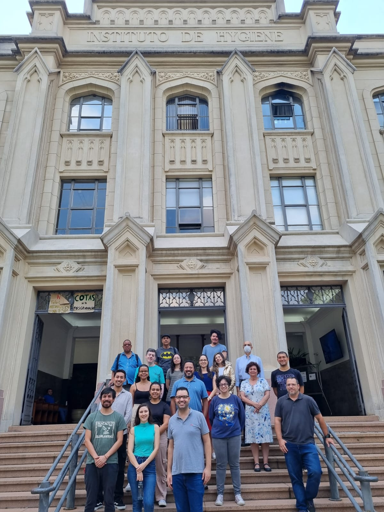
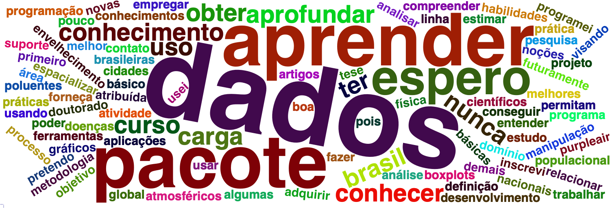

# Material do curso Introdução à Linguagem de Programação em R para tratamento de dados de poluição do ar
Material do curso [_Introdução à Linguagem de Programação em R para tratamento de dados da poluição do ar: o pacote openair_](https://www.fsp.usp.br/site/eventos/mostra/48597).

O curso foi ministrado de 05 a 08 de fevereiro de 2024 oferecido como curso de verão pelo [LEHCA](https://www.fsp.usp.br/lehca/author/lehca/).

## Instruções

Para construir a apresentação você precisa instalar [`rmarkdown`](https://alexd106.github.io/intro2R/install_rmarkdown.html) e [`binb`](https://github.com/eddelbuettel/binb/tree/master?tab=readme-ov-file#usage).

```r
install.packages("rmarkdown")
install.packages("tinytext") # Para exportar em pdf
tinytext::install_tinytext() 
install.packages("binb") # Tema dos slides
```

## A turma


## Nuvem de palavras


## Professores

- Mario Gavidia-Calderón (mario.calderon@iag.usp.br)
- Rafaela Squizzato (rafaela.squizzato@iag.usp.br)
- Thiago Nogueira (thiagonogueira@usp.br)
