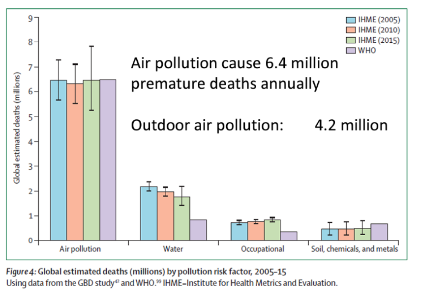
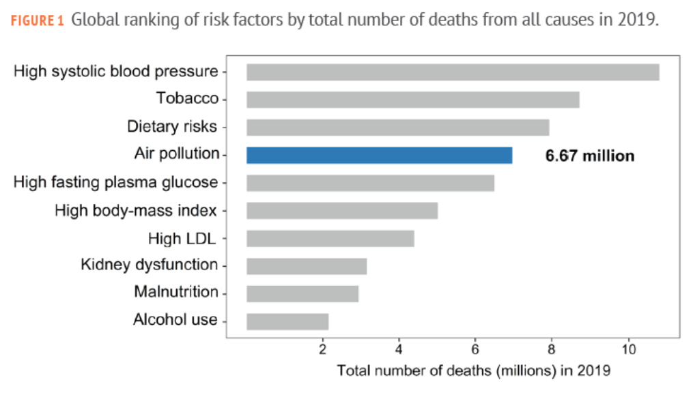
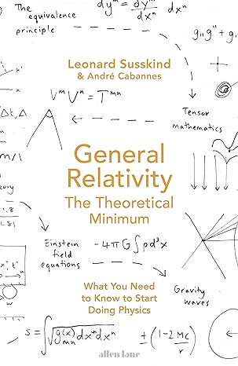

```{r,setup, include=FALSE}
knitr::opts_chunk$set(cache=TRUE)
```

# Introdução

## Por que o curso?
### Efeitos adversos à saúde
```{r, echo=FALSE, fig.align='center'}

```

## Por que o curso?
### **Carga global de doenças** da poluição do ar em 2015:
- \alert{19 \%} de todas as mortes cardiovasculares.
- \alert{23 \%} de toas as mortes por câncer de pulmão.

```{r, echo=FALSE, fig.align='center', out.width="55%"}

```

## Por que o curso?
### Ranking global de **fatores de risco** por número total de mortes em 2019
```{r, echo=FALSE, fig.align='center'}

```

## Por que o curso?

::: columns
:::: column
\
_\"Data! Data! Data!\" He cried impatiently. \"I can't make bricks without clay.\"_\
\
\scriptsize Arthur Conan Doyle, The Adventure of the Copper Beeches- a Sherlock Holmes Short Story.
::::

:::: column
- Precisamos conhecer o \alert{nível da poluição}.
- Para isso precisamos de medições: \alert{dados}.
- Este curso tem como objetivo mostrar como \alert{trabalhar com dados de poluição do ar no R}.
::::
:::
## Por que o curso?

### Além disso
* Analizadores de poluentes medem concentrações com maior frequência.
* R é uma ótima ferramenta para mexer com dados.
* É importante conhecer uma linguagem de programação.

## Um questionário

```{r, echo=FALSE, fig.align='center'}

```


## Por que R?
::: columns

:::: column
- R é uma **Linguagem de programação** para a análise de dados.
   - Um sistema para **estatística**.
   - Um sistema de computação gráfica e **estatística**.
   - Um ambiente para a análise de dados e **estatística**.
::::

:::: column
```{r, echo=FALSE, fig.align='center'}
include_graphics("figures/Rlogo.png")
```
::::

:::

## Por que R?


::: columns

:::: column
- É _open source_ (é **livre**).
- Funciona em qualquer **sistema operacional**.
- Podemos trabalhar **com muitos dados** e **tipos de dados**.
- Grande comunidade de usuários: **Muita ajuda on-line**.
- **Reprodutibilidade** das ciências.
::::

:::: column
```{r, echo=FALSE, fig.align='center'}
include_graphics("figures/Rlogo.png")
```
::::

:::

## Por que R?
::: columns
:::: column
- Muitos **pacotes** para muitas áreas das ciências.
    - `openair` $\rightarrow$ poluição do ar.
    - `sf` e `raster` $\rightarrow$ GIS.
    - `Rmarkdown` $\rightarrow$ Documentos e apresentações.
    - `shiny` $\rightarrow$ aplicações e _dashboards_.
    - etc, etc, etc
::::

:::: column
```{r, echo=FALSE, fig.align='center'}
include_graphics("figures/Rlogo.png")
```
::::
:::

# RStudio

## RStudio
```{r, echo=FALSE, fig.cap="Distribuição das janelas do RStuido. Fonte: RStudio User Guide"}
include_graphics("figures/rstudio-panes-labeled.jpeg")
```


## RStudio
- É importante aprender os _keyboard shortcuts_.
   - `Ctrl + 1` : Janela scripts.
   - `Ctrl + 2` : Janela console.
   - `Alt + - ` : `<-`
   - `Ctrl + d` : Apaga linha.
   - `TAB`: Autocompleta nome de funções e diretórios de arquivos.
- Na console, $\uparrow$ e $\downarrow$ procura comandos anteriores.

## RStudio
- No scripts
   - `Alt + shift + ` $\downarrow$: Copia linha.
   - `Ctrl + Enter`: Executa a linha.
   - `Ctrl + a`: Seleciona todo o script.

# Sintaxe Básica

##  _The theoretical minimum_

::: columns
:::: column
- _What you need to know to start  \alert{doing  R}_

::::

:::: column
```{r, echo=FALSE}

```
::::
:::

## Antes de começar
::: columns
:::: column
\textsc{Lei de Murphy}\

_Se algo pode dar errado, dará._

::::

:::: column
- R é _case-sensitive_:\ `uma_variavel` $\neq$ `Uma_variavel`.
- Lembrem de fechar os `( )` 
- Lembrem das `,`
- \alert{Atentos} ao seguir os exemplos.
::::
:::


## R como calculadora

- R é uma calculadora. 
- Segue a ordem das operações
```{r, echo=TRUE}
(5 + 10 * 2 / 4) ^ 2 - 5
```

## Declarar variavéis

- No R usamos \textbf{\alert{<-}} em vez de **`=`** para definir variavéis.
```{r}
R <- 8.314
R
```


## Comentar

- Para comentar usamos **`#`**. O código após o **`#`** não é lido.

```{r , echo = TRUE}
R <- 8.314 # Constante universal dos gases (J K / mol)
R
```


## Funções
- Para usar funções: **`nome_da_função()`**. 
- Dentro dos `()` colocamos os **argumentos**.
```{r , echo = TRUE}
class(R)
```

## Objetos

- No R existem diversos tipos de objetos.

- **`character`**
```{r, echo=TRUE}
o3_nome <- "ozônio"
class(o3_nome)
```
- **`numeric`**
```{r, echo=TRUE}
this_year <- 2024
g <- 9.81 # m/s2
class(this_year)
class(g)
```

## Objetos 

- `booleans`
```{r , echo = T}
verdade <- TRUE
verdade
falso <- 5 > 10
falso
muito_falso <- "cinco" == "5"
muito_falso
```


## Vetores
- É definido usando a função **`c()`**. Só podem ter um único tipo de objeto.
```{r, echo=TRUE}
pontos_cardeais <- c("N", "E", "S", "W")
pontos_cardeais # só character
pontos_cardeais_graus <- c(0, 90, 180, 270)
class(pontos_cardeais_graus) # só numeric
```

## Vetores
- Uma \alert{sequência} é definida **`seq(início, final, intervalo)`**
```{r, echo=T}
de_1ate5 <- seq(1, 5)
de_1ate5
pares_ate10 <- seq(0, 10, 2)
pares_ate10
sec_float <- seq(0, 1, 0.2)
sec_float
```

## Vetores
- Para saber quantos elementos tem um vetor usamos a função `length`.
```{r}
length(de_1ate5)
length(sec_float)
```


## Vetores
- Para \alert{selecionar} elementos do vetor: **`nome_vetor[posição]`**:
```{r, echo=T}
# Primeiro elemento
pontos_cardeais_graus[1]
# Último elemento
pontos_cardeais_graus[4]
```


## Vetores

- Podemos \alert{selecionar} vários elementos usando **`outro vetor`**
```{r , echo=T}
# Segundo y tercero
pontos_cardeais[c(2, 3)]
```
- Podemos \alert{eliminar} elementos usando **`nome_vetor[-posição]`**
```{r, echo=T}
GEE <- c("H2O", "CO2", "O2", "CH4")
GEE 
GEE[-3] # Oxigênio não é GEE
```

## Vetores

- Podemos Substituir um elemento do vetor assim:
```{r, echo=T}
# Substituímos Oxigênio por Ozônio
GEE[3] <- "O3"
GEE
```

## Exercicio 1

Criar três vetores. Um vetor chamado `pol_sp` com os poluentes que tem padrão de qualidade do ar no Estado de São Paulo.  Outro vetor chamado `pol_amostra` com **o menor tempo de amostragem** em horas. Finalmente, um vetor chamado `pol_pqa` com o respectivo padrão de qualidade do ar. 

Referência: [Padrões de qualidade do ar CETESB](https://cetesb.sp.gov.br/ar/padroes-de-qualidade-do-ar/)

## Exercicio 1

```{r}
pol_sp <- c("MP10", "MP2.5", "SO2", "NO2", "O3", "CO", "FMC", "PTS", "PB")
pol_amostra <- c(24, 24, 24, 1, 8, 8, 24, 24, 365*24)
pol_pqa <- c(100, 50, 40, 240, 130, 9, 100, 240, 0.5)
```


## Operações *Element-wise* 
```{r, echo=T}
tempC <- c(27, 32, 28, 26)
tempK <- tempC + 273.15
tempK
tempk_chr <- as.character(tempK)
str(tempk_chr)

```

## Operações *Element-wise*
```{r}
pol_atr <- c("nome", "pm", "conc", "unit")
paste("o3", pol_atr, sep = "_")
```


# Data Frames

## R: Objetos - `data frames`
- Um `data frame` é uma **tabela**
- Uma matriz **indexada**: tem nomes das **colunas** e **linhas**.
- Cada **coluna** é uma **variável**.
- Cada **linha** é uma **observação**.
- Um conjunto de vetores.

##  `data frame`
- Criamos um **`data frame`** usando a função **`data.frame()`**
```{r , echo=TRUE}
gases <- c("N2", "O2", "Ar", "CO2")
massa_molar <- c(28, 32, 40, 12 + 2 * 16)
percentagem <- c(78.08, 20.95, 0.9, 0.04)

ar <- data.frame(gas = gases,
                 W = massa_molar,
                 per = percentagem)
```


## `data frame`
```{r}
ar
```

## `data frame`
- Criamos um **`data frame`** usando a função **`data.frame()`**
```{r , echo=TRUE}
ar <- data.frame(gas = c("N2", "O2", "Ar", "CO2"), # Ou diretamente
                 W = c(28, 32, 40, 12 + 2 * 16),
                 per = c(78.08, 20.95, 0.9, 0.04))

```

## `data frame`
```{r}
ar
```


## Selecionar colunas **`$`**
- Selecionamos uma **coluna** de um **`data frame`** como um **`vetor`**
- Sintaxis: `df$nome_coluna`
- E.g. Nome dos componentes do ar
```{r, echo=T}
ar$gas
class(ar$gas)
```

## Selecionar filas e colunas **`[]`**
- Selecionamos uma **coluna** de um **`data frame`** como um **`data frame`**
- Sintaxis: `df[interiro]` ou `df[nome_coluna]`
- E.g. Nome dos componentes do ar
```{r, echo=T}
ar[1] # ou ar["gas"]
class(ar[1]) 
```
- **Atenção!**: `ar[1]` $\neq$ `ar$gas` 


## Selecionar filas e colunas **`[]`**
- Algumas funções precisam `vetores` como **input**
- e.g. média massa molar
```{r, echo=T}
mean(ar["W"])
mean(ar$W)
```

## Criando novas colunas
- Usamos **`$`**: **`df$nova_coluna <- nova_coluna`**
```{r, echo=T}
# Adicionamos o nome completo dos gases.
ar$name <- c("Nitrogênio",
             "Oxigênio",
             "Argônio", 
             "Diôxido de Carbono")
ar
```

## Algumas funções importantes
- Número de linhas: **`nrow()`**
- Número de colunas: **`ncol()`**
```{r, echo=T}
nrow(ar)
ncol(ar)
```

## Algumas funções importantes
- Tipo de objeto de cada coluna: **`str()`**
```{r, echo=T}
str(ar)
```
- nome das colunas
```{r, echo=T}
names(ar)
```


## Algumas funções importantes
- Primeiras observações: **`head()`**
- Últimas observações: **`tail()`**
```{r, echo=T}
head(ar)
tail(ar)
```

## Algumas funções importantes
- Primeiras observações: **`head()`**
- Últimas observações: **`tail()`**
```{r, echo=T}
head(ar, 2)
tail(ar, 2)
```

## Substituição de coluna
- Para subsituir uma coluna, ela tem que ter \alert{o mesmo número de filas}.
```{r, echo=T}
# Em espanhol
ar$nombres <- c("Nitrógeno", 
                "Oxígeno",
                "Argón", 
                "Dióxido de carbono")
ar

```

## Exercicio 2

- Criar um `data.frame` llamado `pqa_sp` usando os vetores do Exercicio 1.
- Adiciona una coluna chamada `pm` con o peso molecular de cada poluente. Para MP colocar 1.
- Adiciona una coluna chamada `nome` com o nome completo de cada poluente.

## Exercicio 2
```{r}
pqa_sp <- data.frame(
  pol_sp,
  pol_amostra,
  pol_pqa
)
pqa_sp$pm <- c(1, 1, 32 + 16 * 2, 14 + 16 * 2, 16 * 3, 12 + 16, 1, 1, 207.2)
```


## `data frames`: Ler arquivos `.csv`

- Vamos ler dados do ano 2023 do aeroporto de Guarulhos.
- Os dados são baixados do site [**ASOS Network da Iowa State University**](https://mesonet.agron.iastate.edu/request/download.phtml?network=BR__ASOS).
- No R para ler tabelas em csv (e para outros formatos) usamos a função \alert{`read.table()`}.
- Esta função precisa saber o **diretório do arquivo**. Para isso podemos usar a função **`file.choose()`**.

## `data frames` Ler arquivos `.csv`

```{r}
gru <- read.table("../../data/SBGR.csv", # ou file.choose()
                  header = TRUE, # se as colunas tem nome
                  sep = ",", # o separador de colunas
                  dec = ".") # o separador decimal
```

## `data frames` Ler arquivos `.csv`
- Exploramos o nome das colunas do data frame:
```{r}
names(gru)
```

## `data frames` Ler arquivos `.csv`
- Exploramos a estrutura do `data frame`.
```{r}
str(gru)
```

## Operações
- A temperatura está em Farenheit e a velocidade de vento está em nós.
```{r}
gru$tc <- (gru$tmpf - 32) * 5 / 9
```

## Operações
- A temperatura está em Farenheit e a velocidade de vento está em nós.
```{r}
gru$ws <- gru$sknt * 0.51
```

## Análise exploratória de dados (AED)
- Vamos olhar as estatísticas básicas usando `summary()` da temperatura, velocidade do vento, umidade do ar.
```{r}
summary(gru[c("tc", "relh", "ws")])
```

## Análise exploratória de dados (AED)
- Ou podemos calcular _manualmente_:
```{r}
mean(gru$tc, na.rm = TRUE) # na.rm = TRUE não considera NA
median(gru$tc, na.rm = TRUE)
```

## Análise exploratória de dados (AED)
```{r}
max(gru$tc, na.rm = TRUE)
min(gru$tc, na.rm = TRUE)
sd(gru$tc, na.rm = TRUE)
```

## Exercio 3

- Baixe os dados do aeroporto de campo de marte para o ano 2023.
- Transforme a Temperatura para Celcius, e a velocidade do vento para m s$^{-1}$.
- Existen datos faltantes?
- Todos as colunas foram lidas corretamente?

## Um plot simples
```{r, eval=FALSE}
plot(gru$tc, # vetor para plotar
     t = "l", # tipo de plot, l = linha
     xlab = "2023", # nome do eixo x
     ylab = "Temperatura (C)", # nome eixo y
     col = "orange", # color da linha
     lwd = 1.25 # largura linha
     )
```

## Um plot simples
```{r, echo=FALSE}
plot(gru$tc, 
     t = "l",
     xlab = "2023",
     ylab = "Temperatura (C)",
     col = "orange",
     lwd = 1.25)
```

## Histograma
```{r}
hist(gru$tc)
```

## Um diagrama de caixa
```{r}
boxplot(gru$tc)
```

## Um _scatter plot_
```{r, eval=FALSE}
plot(gru$tc, # valores eixo x
     gru$relh, # valores eixo y
     col = "lightblue", # color dos pontos
     xlab = "Temperatura (C)", # nome eixo x
     ylab = "Umidade relativa (%)" # nome eixo y
     )
```

## Um _scatter plot_
```{r, echo=FALSE}
plot(gru$tc, # valores eixo x
     gru$relh, # valores eixo y
     pch = 19, # tipo de ponto
     col = "lightblue", # color dos pontos
     xlab = "Temperatura (C)", # nome eixo x
     ylab = "Umidade relativa (%)" # nome eixo y
     )
```

## Coeficiente de correlação
```{r}
cor(gru$tc, # variavel x
    gru$relh) # variavel y
```

## Exercicio 4

- Calcule a média, mediana, min, max e sd, da Temperatura, Umidade relativa, Velocidade do vento no Aeroporto Campo de Marte.
- Faça uma série temporal, um histograma e um boxplot destes parâmetros. 
